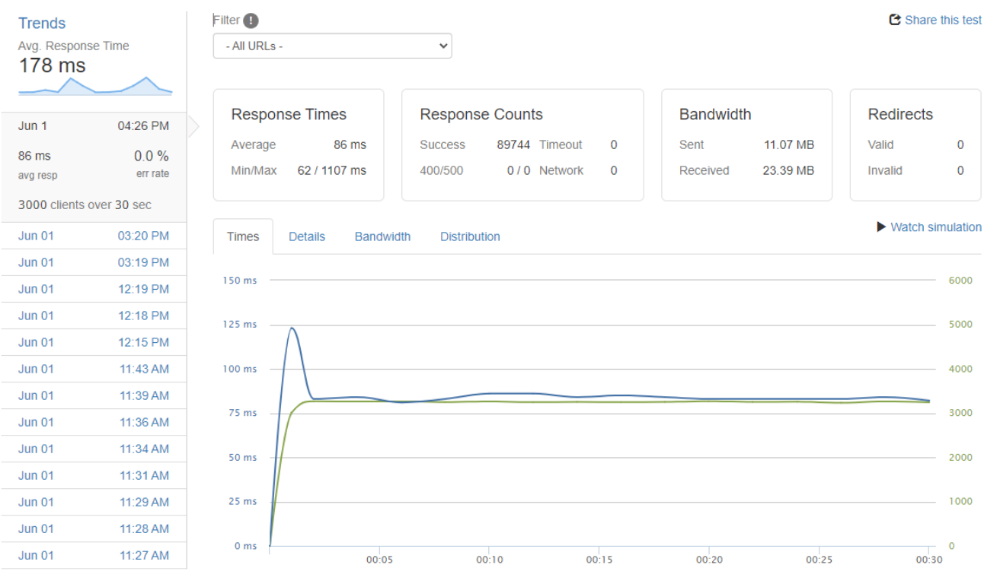

# System Design Capstone

A backend server application that provides an API for managing product information in an ecommerce system. This API supports an existing retail web application with a modernized system able to withstand web scale traffic loads up to 3000 requests per second. As part of my team's strategy, we decomposed the pre-existing API into three constituent services: Products, Questions/Answers, and Reviews. The focus of this portion of the project is the Product section, which serves four distinct endpoints and retrieves data from six PostgreSQL tables.

## Table of Contents

1. [Description](#description)
2. [Technologies](#technologies)
3. [Visuals](#visuals)
4. [API Endpoints](#api-endpoints)
5. [Getting Started](#getting-started)
6. [Code Highlight](#authors-and-contributors)
7. [Wins and Improvements](#wins-and-improvements)


## Description

This API server is responsible for handling requests related to product data. It utilizes Node.js and Express.js to create a robust and scalable server-side application. PostgreSQL is used as the underlying database to store and retrieve the necessary data. The project follows a microservices architecture, with the Product service focusing on serving product-related endpoints.


## Technologies

- [Node.js](https://nodejs.org/)
- [Express.js](https://expressjs.com/)
- [MongoDB](https://www.mongodb.com/)
- [PostgreSQL](https://www.postgresql.org/)
- [Docker](https://www.docker.com/)
- [nginx](https://nginx.org/)
- [k6](https://k6.io/)
- [Artillery](https://www.artillery.io/)
- [Loader.io](https://loader.io/)

## Visuals




## API Endpoints

The following API endpoints are available for interacting with the ProductAPI Server:

- `GET /api/products`: Retrieves a list of all products.
- `GET /api/products/:productId`: Retrieves details of a specific product.
- `GET /api/products/:productId/styles`: Retrieves details of a specific product's styles.
- `GET /api/products/:productId/related`: Retrieves details of a specific product's related product IDs.

## Getting Started

To run the ProductAPI Server locally, follow these steps:

1. Clone the repository: `git clone https://github.com/your-username/productapi-server.git`.
2. Configure a PostgreSQL user.
3. Install dependencies: `npm install`.
4. Rename the `.env.example` file to `.env` and update the configuration settings.
5. Start the server in development mode: `npm run server-dev`.
6. The server should now be running on `http://localhost:3000`.

You can use tools like cURL or Postman to test the API endpoints.

## Code Highlight

This portion of the code resides in the models.js file and is responsible for retrieving and formatting data through SQL database queries. By consolidating multiple queries and performing data transformation in the database instead of in the server, HTTP requests times are significantly faster (38.3% average reduction).
```
  getStylesFromDb: async (productId) => {
    const stylesQuery = `
      SELECT
        s.id AS style_id,
        s.style_name AS name,
        s.original_price,
        s.sale_price,
        s.isdefault AS "default?",
        (
          SELECT jsonb_agg(DISTINCT jsonb_build_object(
            'thumbnail_url', p.thumbnail_url,
            'url', p.regular_url
          ))
          FROM photos p
          WHERE p.style_id = s.id
        ) AS photos,
        jsonb_object_agg(
          sku.id,
          jsonb_build_object(
            'quantity', sku.quantity,
            'size', sku.size
          )
        ) AS skus
      FROM
        styles s
        JOIN skus sku ON s.id = sku.style_id
        LEFT JOIN photos p ON p.style_id = s.id
      WHERE
        s.product_id = $1
      GROUP BY
        s.id
      ORDER BY
        s.id ASC
    `;

    try {
      const stylesResults = await db.query(stylesQuery, [productId]);
      const styles = stylesResults.rows;
      return { product_id: productId, results: styles };
    } catch (error) {
      throw error;
    }
  },
```
credit @[jerryrenn](https://github.com/jerryrenn)

## Wins and Improvements

By horizontally scaling this deployed API to 3 separate AWS EC2 instances and implementing NGINX load balancing and caching, we were well able to surpass the client's throughput goal of 100 requests per second. Under a load of 3000 virtual users (VUs) at maximum over a duration of 30 seconds, this system is able to maintain a response time below 250 milliseconds (ms) for all four endpoints, with an error rate of less than 0.05% while handling a throughput up to 3000 RPS.

Additional optimization can be implemented, particularly with Redis caching in the future.
